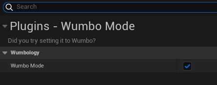

# WumboMode
So you can say "yes" when people ask if you tried "setting it to Wumbo".

The plugin that every project needs.

## How to Use

You can get to the option under Project Settings -> Plugins -> WumboMode



## Installation

Clone this into your project's plugins directory. Add this to your `.uproject` file.

```
{
    "Name": "WumboMode",
    "Enabled": true,
    "MarketplaceURL": ""
}
```

Add this as a dependency in your project's build.cs file.

```
...
PublicDependencyModuleNames.AddRange(new string[] { "Core", "CoreUObject", "Engine", "InputCore", ... "WumboMode"});
...
```
